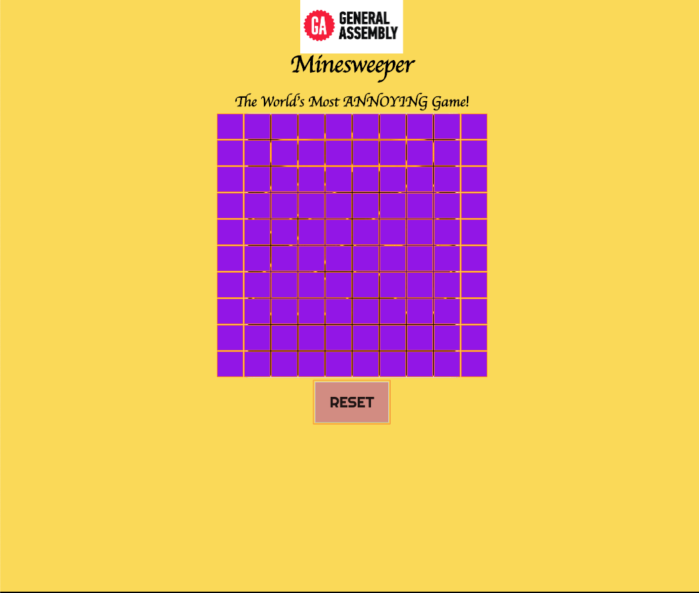
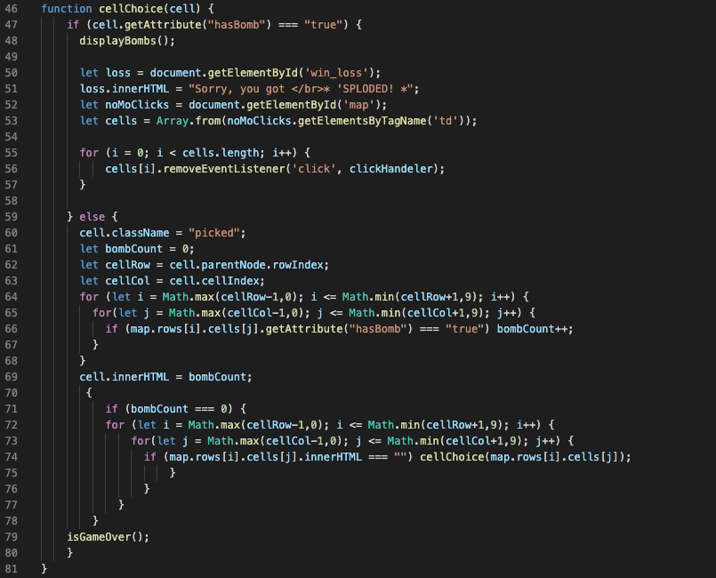
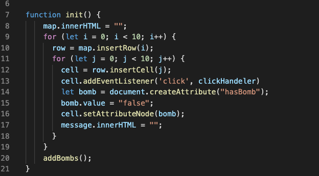

#  Minesweeper

##  Project 1 

Minesweeper is a test of skill and an exercise in deductive thought. It will test, not only your skills of patterns and 
problem solving, but it will test your patience as well.

###  RULES
The object is to pick a cell, and do your best to avoid picking a mine, which will end the game. 
If you choose a cell with a numeric value, it is a hint to how many mines are merely one cell away! 

  

###  TECH USED
We’re writing this in Javascript, CSS, and HTML, so we’re hoping for the best… Come play the game 
that’s “Sweeping” the Nation (or at least this little corner of the room), and don’t step on any mines!

  
  

###  411 
The game was designed to test your numerical processing prowess, and the ability to decode patterns to the numbers ,
thus allowing you to avoid being *'SPLODED!*

#  In memory of the late Kobe Bryant, I dedicated my design to the Black Mamba, himself. RIP

  Check out the game so far... [HERE, RIGHT HERE!!!](https://whskyrbbt.github.io/Project-1/)

Future itterations will hopefully include: 
  A win overlay that shows random pic of Kobe highlights.
  Randomizing the color scheme to match away game colors, and home game colors alternately. 
  Rewrite the code to be more efficient.
  Add Difficulty options 
  Add Bomb count number inptut
  

  
  
